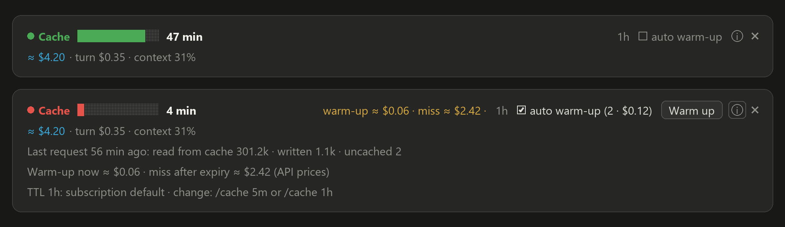

# Prompt Cache Timer

A band above the Claude Code prompt that shows how long your prompt cache stays warm, what the session has cost at API prices, and what a cache miss would cost you compared with warming the cache now.



Claude Code caches the conversation it sends with every request. A cached prefix is read at a fraction of the input price; once the cache expires, the next request writes the whole conversation again at full price or more. On a long session that difference is dollars per message. Prompt Cache Timer makes the expiry visible so you can come back in time, warm the cache for cents, or let it keep itself warm.

## What it shows

- **Countdown** to the cache's expiry, with a progress bar that turns yellow and then red. Whole minutes far from expiry, seconds in the last two minutes.
- **Cost** (`≈ $4.20`) of the session and of the latest turn at Anthropic API list prices, and how full the context window is. On a subscription this is what the same work would cost on the API, not a charge.
- **Near expiry:** the price of a warm-up next to the price of a miss, for example `warm-up ≈ $0.06 · miss ≈ $2.42`, and a **Warm up** button.
- **Misses:** a red marker when a request had to write the cache again, with what that write cost.
- **ⓘ** opens the details: the last request's cache reads and writes, both prices, and where the TTL came from.
- **Auto warm-up** (off by default, per session): warms the cache just before it expires, at most once per cache entry, including during a long command that sends Claude nothing. It shows how many warm-ups it made and what they cost, and turns itself off after 4 hours without a request of yours.

## The cache TTL

The timer counts with the TTL Claude Code uses, taken in this order:

1. the `CLAUDE_CODE_PROMPT_CACHE_TTL` environment variable;
2. the `promptCacheTtl` setting;
3. your choice with `/cache 5m` or `/cache 1h`;
4. the TTL a model switch reports;
5. the default for your access: 1 hour on a Claude subscription within its usage limits; 5 minutes past those limits, on an API key, Bedrock, Vertex AI or Foundry.

Without 1 or 2, the band also corrects itself from what the cache does: a request after a pause of 5 to 60 minutes that hits the cache means the TTL is 1 hour, one that misses means 5 minutes.

## Commands

- `/cache` hides or shows the band
- `/cache 5m`, `/cache 1h` set the TTL
- `/cache warm` warms the cache now

## Languages

English, Russian, Ukrainian, German, French, Spanish, Portuguese, Italian, Japanese, Chinese and Korean. The band follows the plugin's **Language** option; on `auto` (the default) it follows Claude Code's `language` setting, then your system language.

## Requirements

Claude Code with mods: the desktop app 2.1.286 or later, or the terminal 2.1.287 or later. The band draws in the terminal and in the desktop app's Code tab.

## Install

From the Claude plugin directory, or from this repository:

```
/plugin marketplace add lex-96/prompt-cache-timer
/plugin install prompt-cache-timer@prompt-cache-timer
```

## What it reads and does

- Reads, inside Claude Code: the token usage of each model response, the session cost and context fill as `/cost` and the status line report them, and the usage windows a subscription reports.
- Reads Claude Code's merged settings once per session start and uses exactly two keys of them, `language` and `promptCacheTtl`; nothing else in them is kept or used.
- Reads four environment variables, none of them a credential: `CLAUDE_CODE_PROMPT_CACHE_TTL`, `CLAUDE_CODE_USE_BEDROCK`, `CLAUDE_CODE_USE_VERTEX` and `CLAUDE_CODE_USE_FOUNDRY`.
- Reads no API key, token or other credential, and nothing it reads leaves the band.
- Stores one value on your machine: the TTL you chose with `/cache`.
- Sends nothing anywhere. A warm-up, manual or automatic, is a one-word request through your own Claude Code session over its existing conversation; it uses your plan or API key like any request.
- Prices come from Anthropic's published list prices for Claude models; models it does not know show no warm-up or miss price.

## Hooks

Every hook observes and passes the event on unchanged, except `/cache`, which the plugin answers itself.

| Hook | What it does |
| --- | --- |
| `session.start` | Picks the language and the TTL, registers `/cache`, starts the once-a-second timer. |
| `turn.step` | Reads the cache usage of each model response; the response streams through untouched. |
| `turn.start`, `turn.complete` | Read the session cost for the turn's cost. |
| `classic.PostModelSwitch` | Reads the TTL a model switch reports and restarts the timer: a switch forfeits the cache. Changes nothing in the switch. |
| `session.end` | On `/clear`, restarts the timer. |
| `command.run` for `cache` | Answers `/cache` and its arguments. Other commands, including other plugins' and those the model runs, pass through untouched. |
| `ui.render` for `AbovePrompt` | Draws the band above the prompt; gives way to a survey there. |

## License

MIT
